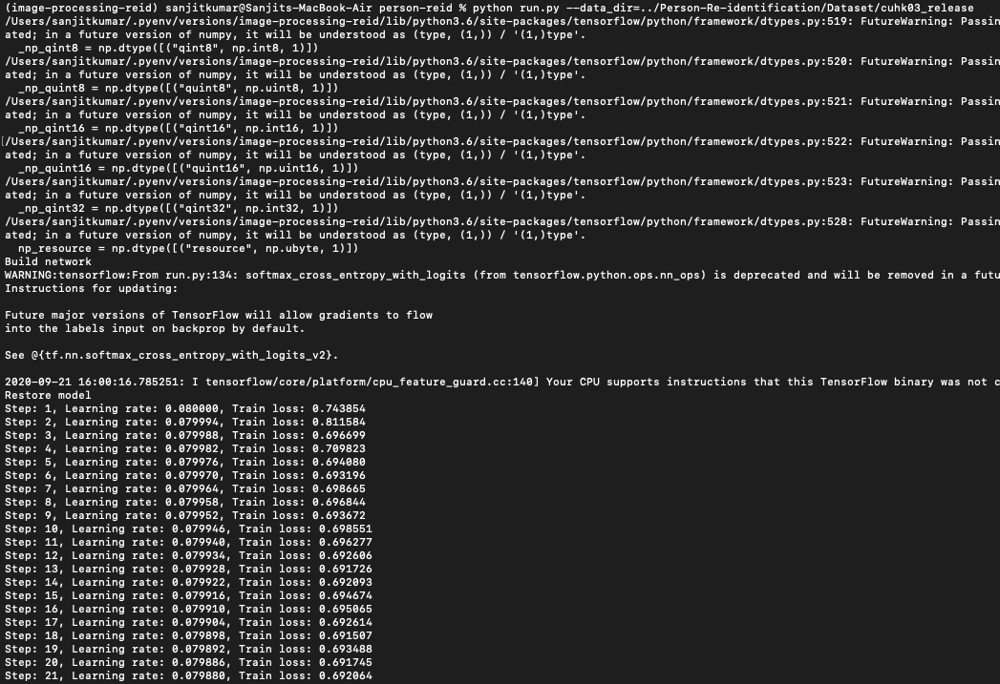

# Image Re-identification using Deep Neural Network with CUHK03 Dataset

## Dependencies
* Mac OSX 10.15.6
* Python 3.6.4
* TensorFlow 1.8
* absl-py 0.10.0
* astor 0.8.1
* bleach 1.5.0
* gast 0.4.0
* grpcio 1.32.0
* h5py 2.10.0
* numpy1.19.2
* opencv-python 4.4.0.42
* protobuf3.13.0
* six1.15.0
* termcolor1.1.0
* Werkzeug1.0.1
* zipp3.1.0

## Prepare dataset
Original Dataset Link - [Click Here](http://www.ee.cuhk.edu.hk/~xgwang/CUHK_identification.html)

## Training and Validation

The training and validation of the dataset is done with using CUHK03 Dataset. The Computation power expected by the model to gain enough feature knowledge to perform with sufficient accuracy is much above that processing power of Macbook Air 2013 4 Cores with and i5 processor.

Validation Accuracy reached during training is 50%.

## Output

### Training a sample of 21 epochs with 0.08 learning rate

### Validation with same training sample

### Sample pictures re-id with image 0000_05 and 0000_07

